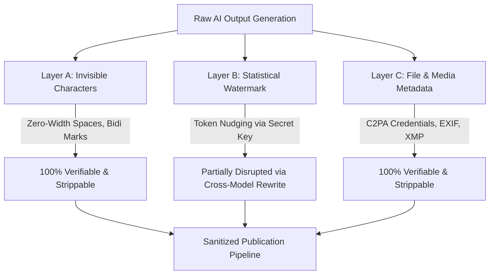

# AI Watermarking, Provenance, and Anti-Slop Sanitization
## Complete Technical Breakdown: EU AI Act, Token Distribution Steganography, and Metadata Stripping

> "On August 11, Anthropic announced that Claude is going to watermark the text it writes... The reason it is happening now is the EU AI Act's transparency rules. The watermark is not sitting in the file; it is sitting in the word choices themselves." — Maverick Maltin

---

## 1. The 3-Layer Anatomy of AI Watermarks

To understand what can and cannot be cleaned, we must dissect the 3 distinct layers of AI provenance:



---

### Layer A: Invisible Unicode Characters (Trivial & 100% Strippable)
* **What it is:** AI systems frequently introduce non-printing Unicode characters:
  - Zero-width spaces (`\u200B`)
  - Zero-width non-joiners (`\u200C`) and joiners (`\u200D`)
  - Word joiners (`\u2060`)
  - Byte Order Marks (`\uFEFF`)
  - Left-to-Right / Right-to-Left directional overrides (`\u202A` - `\u202E`)
* **Impact:** Causes cryptic bugs in web CMSs, markdown parsers, and code linters; immediately flags text in heuristic AI checkers.
* **Solution:** Deterministic regex purge:
  ```python
  import re
  INVISIBLE_CHARS = re.compile(r'[\u200B-\u200D\u2060\uFEFF\u202A-\u202E\u00A0]')
  clean_text = INVISIBLE_CHARS.sub('', raw_text)
  ```

---

### Layer B: The Statistical Token-Level Watermark (The EU AI Act Compliance Layer)
* **How it works:**
  1. When an LLM generates a token, it evaluates a probability distribution over the entire vocabulary.
  2. For most contexts, multiple synonymous words have nearly identical likelihood.
  3. Under statistical watermarking, a pseudo-random number generator (PRNG) keyed by a private seed partitions the vocabulary into "green" (favored) and "red" (disfavored) lists based on preceding tokens.
  4. The model slightly boosts probabilities of "green" tokens.
  5. Individually, the sentence reads naturally. Across a 200–500 word passage, a statistical test using the secret key detects an anomalous concentration of green tokens with near-zero false positive probability.
* **The "Doable" Reality vs. "Unachievable" Myths:**
  - **Myth:** "Retyping by hand or pasting into Notepad removes it." (False: the signal is in the vocabulary selections, not the clipboard formatting).
  - **Myth:** "Any tool can guarantee 100% unflagged text." (False: only the model creator holds the detection key and scoring threshold).
  - **What Actually Works:** **Cross-Family Model Paraphrasing**.
    - Never use Claude to rewrite Claude text (it re-injects the same distribution).
    - Pass Claude drafts to Gemini or GPT with specific structural constraints: varying sentence clauses, substituting function words, and eliminating formulaic transitions.
* **Production Paraphrase Prompts (from Maverick's Arsenal):**

#### Precision Rephrase (Preserves 100% Facts & Technical Identifiers):
```text
Rewrite the following text so that it uses substantially different wording at the token level.
Change clause order, connectors, and transition words; vary sentence boundaries and length;
and replace both content words and function words where meaning allows.
Preserve all facts, numbers, names, and technical identifiers. Do not add or remove claims.
Output only the rewritten text.
---
[PASTE TEXT]
```

#### Natural Human Voice Rephrase (For Social & Outbound Engagement):
```text
Rewrite the following text so it reads as if a seasoned human systems engineer wrote it from scratch.
Vary sentence rhythm and length, replace formulaic AI-style transitions and filler with concrete,
grounded phrasing, and use plain, varied wording. Ban all generic buzzwords ("delve", "robust",
"game-changer", "seamless", "synergy"). Preserve all facts, metrics, and technical constraints.
Output only the rewritten text.
---
[PASTE TEXT]
```

---

### Layer C: File & Media Metadata (C2PA & EXIF)
* **What it is:** Modern image generators (Midjourney, DALL-E 3, Imagen, Higgsfield) and PDF/SVG compilers embed cryptographic provenance metadata according to Coalition for Content Provenance and Authenticity (C2PA) standards.
* **Impact:** Platforms like LinkedIn, YouTube, and Google Photos inspect this metadata to automatically tag content as "AI-generated" or adjust algorithmic feed reach.
* **Solution:** Complete metadata stripping before publication:
  - For images (PNG/JPEG): Re-encode pixel buffers or execute `exiftool -all= -overwrite_original`.
  - For PDF carousels: Sanitize PDF trailer dictionaries and strip `/Metadata` objects using PyMuPDF (`fitz`) or PDF-lib.

---

## 2. Workspace Integration: The Sanitization Engine

In this repository, all generated LinkedIn carousels, text posts, connection notes, and YouTube assets pass through:
`scripts/sanitize_text_and_media.py`

This ensures that:
1. Every string sent to LinkedIn or stored in `outputs/` is stripped of invisible Unicode characters.
2. All carousel PDFs (`the-midnight-ledger-leak-v3-masterpiece.pdf`) have metadata stripped clean.
3. Every drafted piece complies with Ariya Sarrafzadeh's authentic voice non-negotiables.
